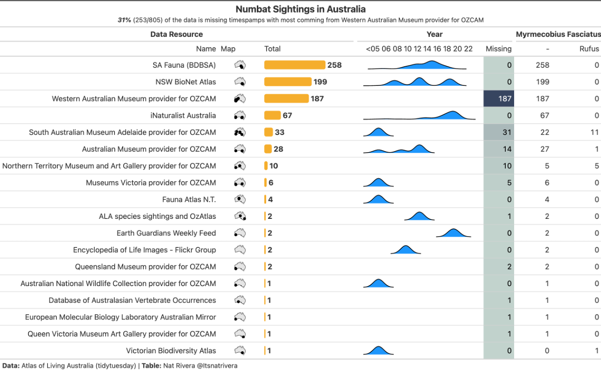
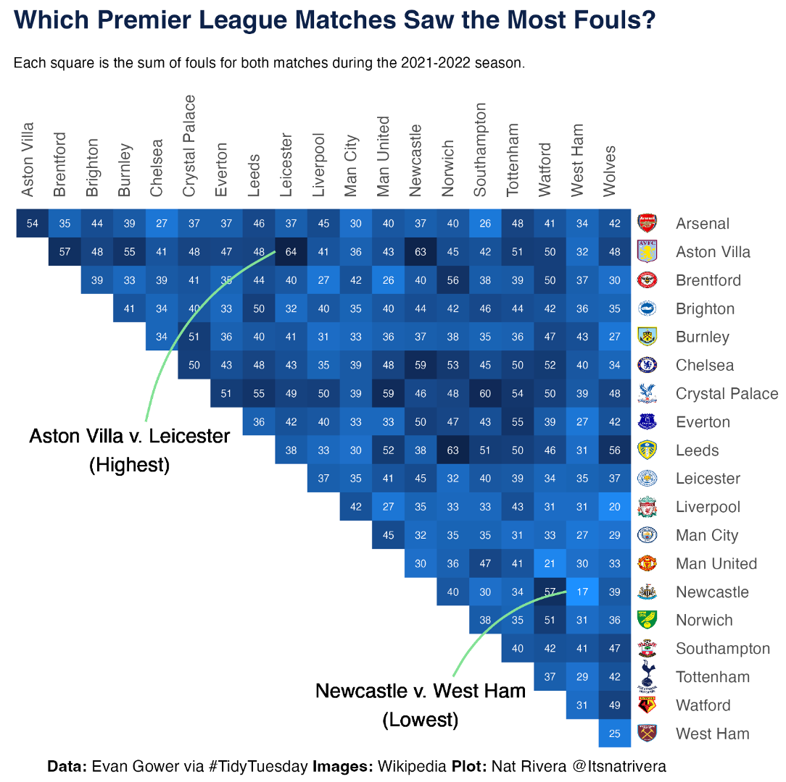
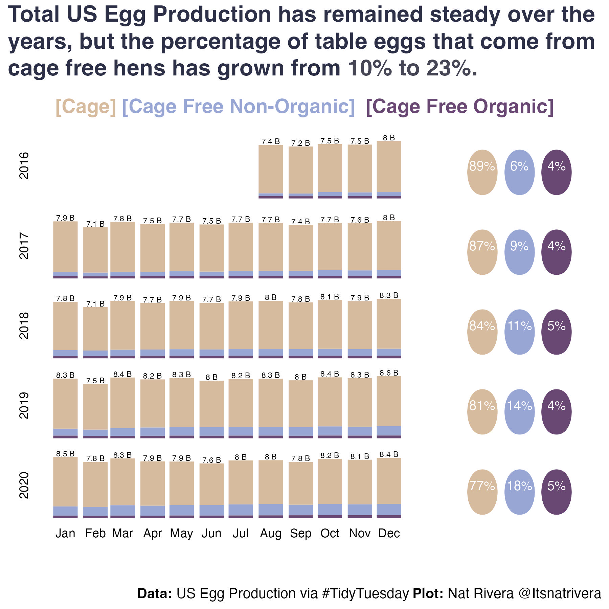

# [2021](https://github.com/natrivera/tidytuesday/tree/main/2021)

# [2022](https://github.com/natrivera/tidytuesday/tree/main/2022)

# [2023](https://github.com/natrivera/tidytuesday/tree/main/2023)

## Week - 1 [Cats UK](https://github.com/natrivera/tidytuesday/tree/main/2023/2023-02-01)

## Week - 2 [Stocks](https://github.com/natrivera/tidytuesday/tree/main/2023/2023-02-07)

## Week - 3 [Age Gaps](https://github.com/natrivera/tidytuesday/tree/main/2023/2023-02-13)

## Week - 4 [Bob Ross](https://github.com/natrivera/tidytuesday/tree/main/2023/2023-02-21)

## Week - 5 [AfriSenti](https://github.com/natrivera/tidytuesday/tree/main/2023/2023-02-27)

## Week - 6 [Numbat](https://github.com/natrivera/tidytuesday/tree/main/2023/2023-03-07)

## Week - 7 [Euro Drug](https://github.com/natrivera/tidytuesday/tree/main/2023/2023-03-14)

## Week - 8 [Programming Languages](https://github.com/natrivera/tidytuesday/tree/main/2023/2023-03-21)

## Week - 9 [World Timezones](https://github.com/natrivera/tidytuesday/tree/main/2023/2023-03-28)

## Week - 10 [Premier League](https://github.com/natrivera/tidytuesday/tree/main/2023/2023-04-04)

## Week - 11 [US Egg Production](https://github.com/natrivera/tidytuesday/tree/main/2023/2023-04-11)

## Week - 12 [London Marathon](https://github.com/natrivera/tidytuesday/tree/main/2023/2023-04-25)

## Week - 13 [Portal Project](https://github.com/natrivera/tidytuesday/tree/main/2023/2023-05-02)

## Week - 14 [US Child Care](https://github.com/natrivera/tidytuesday/tree/main/2023/2023-05-08)

## Week - 15 [UFO Sightings](https://github.com/natrivera/tidytuesday/tree/main/2023/2023-06-20)

## Week - 16 [Global Temps](https://github.com/natrivera/tidytuesday/tree/main/2023/2023-07-04)

## Week - 17 [Zonal Temps](https://github.com/natrivera/tidytuesday/tree/main/2023/2023-07-11)

## Week - 18 [GPT-Detectors](https://github.com/natrivera/tidytuesday/tree/main/2023/2023-07-18)

## Week - xx [US States](https://github.com/natrivera/tidytuesday/tree/main/2023/2023-08-01)

## Week - xx [Hot Ones](https://github.com/natrivera/tidytuesday/tree/main/2023/2023-08-08)

## Week - xx [Ted Lasso F-Bombs](https://github.com/natrivera/tidytuesday/tree/main/2023/2023-09-26)

## Week - xx [Haunted Places](https://github.com/natrivera/tidytuesday/tree/main/2023/2023-10-10)

## Week - xx [Taylor Swift](https://github.com/natrivera/tidytuesday/tree/main/2023/2023-10-17)

## Week - xx 

## Week - xx 

## Week - xx 

## Week - xx 

## Week - xx 

